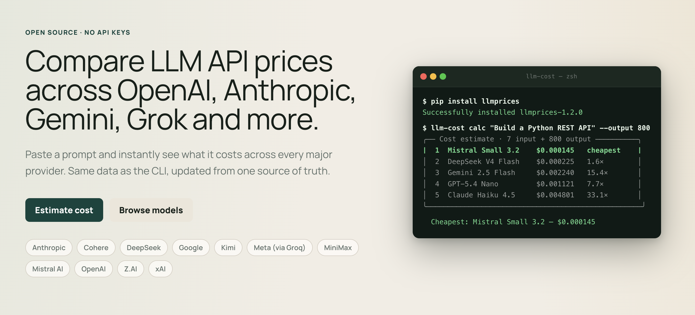
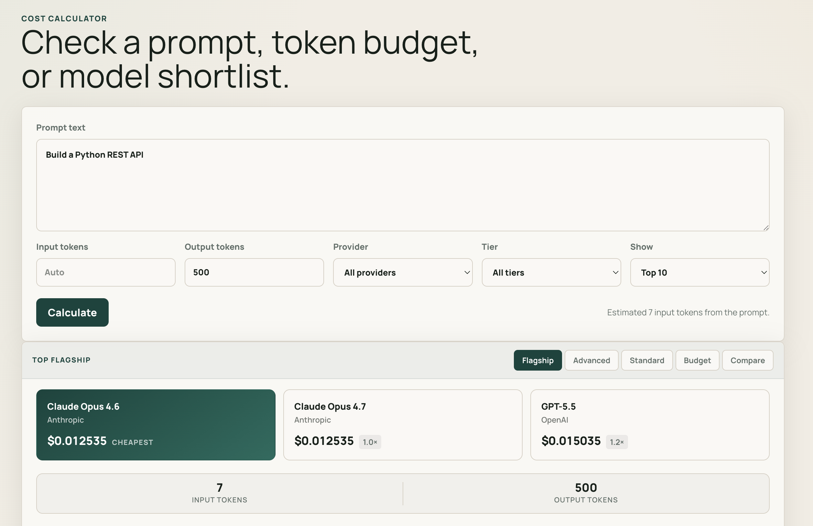
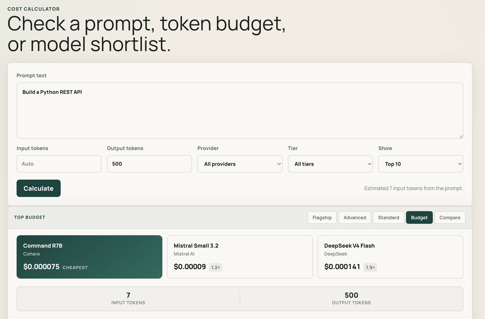
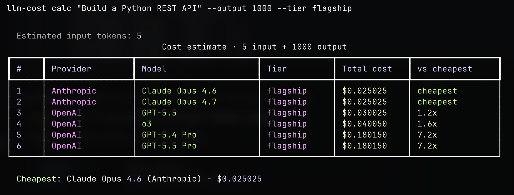
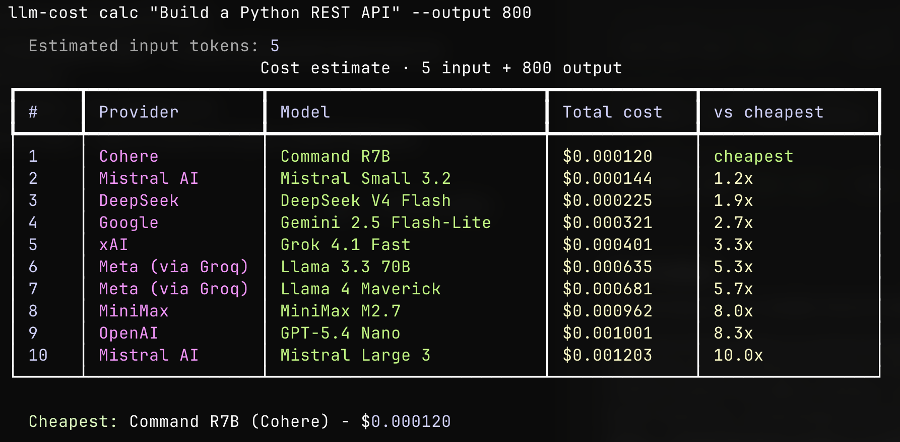
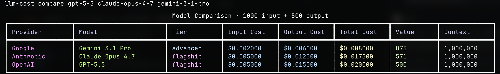
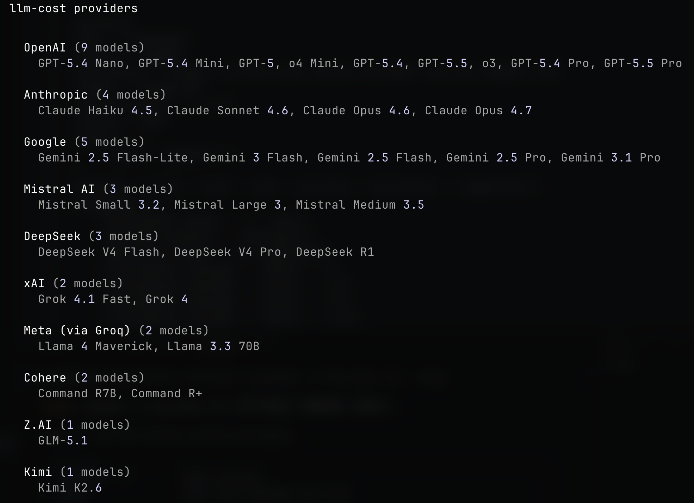

# llmprices

> Compare LLM API prices across providers from the command line.

[](https://pypi.org/project/llmprices/)
[](https://pypi.org/project/llmprices/)
[](https://opensource.org/licenses/MIT)

**Web:** [www.llmcost.run](https://www.llmcost.run)



Find the cheapest model for your prompt in seconds

```
$ llm-cost calc "Build a Python REST API" --output 500
```

```
╭── Cost estimate · 7 input + 500 output ──────────────────────────────────────╮
│  #  Provider      Model                Total cost    vs cheapest              │
│  1  Mistral AI    Mistral Small 3.2    $0.000090     cheapest                 │
│  2  DeepSeek      DeepSeek V4 Flash    $0.000141     1.6x                     │
│  3  Google        Gemini 2.5 Flash-L   $0.000200     2.2x                     │
│  4  xAI           Grok 4.1 Fast        $0.000251     2.8x                     │
│  5  OpenAI        GPT-5.4 Nano         $0.000626     7.0x                     │
│  6  Anthropic     Claude Haiku 4.5     $0.002507     27.9x                    │
│  7  Google        Gemini 3.1 Pro       $0.006014     66.8x                    │
│  8  OpenAI        GPT-5.5              $0.015035    167.1x                    │
╰──────────────────────────────────────────────────────────────────────────────╯

  Cheapest: Mistral Small 3.2 (Mistral AI) — $0.000090
```

---

## Screenshots





---

## Install

```bash
pip install llmprices
```

For accurate token counting (uses tiktoken):

```bash
pip install "llmprices[tiktoken]"
```

---

## Usage

### List all models

```bash
llm-cost list
```



Filter by provider:

```bash
llm-cost list --provider anthropic
llm-cost list --provider openai
```

Filter by efficiency tier:

```bash
llm-cost list --tier flagship    # Top-tier models (GPT-5.5, Claude Opus 4.7, o3)
llm-cost list --tier advanced    # Advanced models (GPT-5.4, Claude Sonnet, Gemini Pro)
llm-cost list --tier standard    # Standard models (GPT-5, Claude Haiku, Gemini Flash)
llm-cost list --tier budget      # Budget models (Nano, Small, Lite models)
```

Sort options (`input`, `output`, `context`, `name`, `value`):

```bash
llm-cost list --sort output
llm-cost list --sort value       # Sort by efficiency/cost ratio
```

Search by name:

```bash
llm-cost list --search gpt-5
llm-cost list --search gemini
```

---

### Calculate cost for a prompt

```bash
# Auto-estimate tokens from text
llm-cost calc "Build a Python REST API" --output 800

# Specify tokens directly
llm-cost calc --input 4000 --output 1000

# Top 5 cheapest only
llm-cost calc --input 10000 --output 2000 --top 5

# Filter to one provider
llm-cost calc "Build a Python REST API" --output 500 --provider google

# Filter by efficiency tier
llm-cost calc "Build a Python REST API" --output 1500 --tier advanced

# Sort by value (efficiency/cost ratio) instead of just cost
llm-cost calc "Build a Python REST API" --output 1000 --sort value --top 10

# One specific model
llm-cost calc "Build a Python REST API" --output 500 --model gpt-5-5
```



**Understanding Value Score:**
The value score represents the efficiency-to-cost ratio. Higher scores mean better value:
- Budget models often have high value scores for simple tasks
- Advanced/Flagship models have lower value scores but better quality
- Use `--sort value` to find the best balance for your use case

---

### Compare specific models

```bash
# Latest flagships head-to-head
llm-cost compare gpt-5-5 claude-opus-4-7 gemini-3-1-pro

# Compare different tiers to see value differences
llm-cost compare gpt-5-5 deepseek-r1 mistral-small-3-2 --input 5000 --output 2000

# Mid-tier sweet spot
llm-cost compare gpt-5-4 claude-sonnet-4-6 gemini-3-flash --input 5000 --output 1000

# Budget tier
llm-cost compare gpt-5-4-nano deepseek-v4-flash grok-4-1-fast mistral-small-3-2

# New agentic models
llm-cost compare deepseek-v4-pro glm-5-1 kimi-k2-6 minimax-m2-7 --input 5000 --output 1000

# From a real prompt
llm-cost compare gpt-5-5 claude-opus-4-7 --prompt "Build a Python REST API"
```



The comparison table shows:
- **Tier**: Efficiency tier (flagship/advanced/standard/budget)
- **Value**: Efficiency-to-cost ratio (higher = better value)
- **Total Cost**: Complete cost for the specified tokens

---

### List providers

```bash
llm-cost providers
```



---

## Supported models (May 2026)

Prices in USD per 1M tokens.

### Efficiency Tiers

Models are categorized by their capabilities and efficiency:

- **Flagship**: Top-tier models with maximum efficiency for complex tasks (GPT-5.5, Claude Opus 4.7, o3)
- **Advanced**: Excellent balance of quality and cost (GPT-5.4, Claude Sonnet, DeepSeek R1, Gemini Pro)
- **Standard**: Solid performance for most tasks (GPT-5, Claude Haiku, Gemini Flash)
- **Budget**: Cost-effective for simple tasks (Nano, Small, Lite models)

| Provider    | Model              | Tier     | Input    | Output   | Context |
|-------------|--------------------|----------|----------|----------|---------|
| OpenAI      | GPT-5.5            | Flagship | $5.00    | $30.00   | 1M      |
| OpenAI      | GPT-5.5 Pro        | Flagship | $30.00   | $180.00  | 1M      |
| OpenAI      | GPT-5.4 Pro        | Flagship | $30.00   | $180.00  | 400K    |
| OpenAI      | o3                 | Flagship | $10.00   | $40.00   | 200K    |
| Anthropic   | Claude Opus 4.7    | Flagship | $5.00    | $25.00   | 1M      |
| Anthropic   | Claude Opus 4.6    | Flagship | $5.00    | $25.00   | 1M      |
| OpenAI      | GPT-5.4            | Advanced | $2.50    | $15.00   | 1.05M   |
| OpenAI      | o4 Mini            | Advanced | $1.10    | $4.40    | 200K    |
| Anthropic   | Claude Sonnet 4.6  | Advanced | $3.00    | $15.00   | 1M      |
| Google      | Gemini 3.1 Pro     | Advanced | $2.00    | $12.00   | 1M      |
| Google      | Gemini 2.5 Pro     | Advanced | $1.25    | $10.00   | 1M      |
| xAI         | Grok 4             | Advanced | $3.00    | $15.00   | 2M      |
| DeepSeek    | DeepSeek R1        | Advanced | $0.55    | $2.19    | 1M      |
| OpenAI      | GPT-5              | Standard | $1.25    | $10.00   | 400K    |
| OpenAI      | GPT-5.4 Mini       | Standard | $0.75    | $4.50    | 400K    |
| Anthropic   | Claude Haiku 4.5   | Standard | $1.00    | $5.00    | 200K    |
| Google      | Gemini 3 Flash     | Standard | $0.50    | $3.00    | 1M      |
| Google      | Gemini 2.5 Flash   | Standard | $0.30    | $2.50    | 1M      |
| DeepSeek    | DeepSeek V4 Pro    | Standard | $1.74    | $3.48    | 1M      |
| Mistral AI  | Mistral Large 3    | Standard | $0.50    | $1.50    | 256K    |
| Mistral AI  | Mistral Medium 3.5 | Standard | $1.00    | $3.00    | 256K    |
| Z.AI        | GLM-5.1            | Standard | $1.40    | $4.40    | 200K    |
| Kimi        | Kimi K2.6          | Standard | $0.95    | $4.00    | 256K    |
| Cohere      | Command R+         | Standard | $3.00    | $15.00   | 128K    |
| OpenAI      | GPT-5.4 Nano       | Budget   | $0.20    | $1.25    | 200K    |
| Google      | Gemini 2.5 Flash-Lite | Budget | $0.10 | $0.40    | 1M      |
| xAI         | Grok 4.1 Fast      | Budget   | $0.20    | $0.50    | 2M      |
| DeepSeek    | DeepSeek V4 Flash  | Budget   | $0.14    | $0.28    | 1M      |
| MiniMax     | MiniMax M2.7       | Budget   | $0.30    | $1.20    | 197K    |
| Mistral AI  | Mistral Small 3.2  | Budget   | $0.06    | $0.18    | 131K    |
| Meta        | Llama 4 Maverick   | Budget   | $0.27    | $0.85    | 1M      |
| Meta        | Llama 3.3 70B      | Budget   | $0.59    | $0.79    | 128K    |
| Cohere      | Command R7B        | Budget   | $0.04    | $0.15    | 128K    |

Notes:

- DeepSeek V4 has two API variants: `deepseek-v4-flash` and `deepseek-v4-pro`.
- Cached-input, batch, promotional, long-context, and subscription-plan discounts are not included in the main table.

Price sources:

- DeepSeek: [Models & Pricing](https://api-docs.deepseek.com/quick_start/pricing)
- Z.AI: [Pricing](https://docs.z.ai/guides/overview/pricing)
- Kimi: [Kimi K2.6 Pricing](https://platform.kimi.ai/docs/pricing/chat-k26)
- MiniMax: [Pay as You Go](https://platform.minimax.io/docs/guides/pricing-paygo)

**33 models across 11 providers.** Prices stored in [`llm_cost/data/prices.yaml`](llm_cost/data/prices.yaml) — PRs to update them are always welcome!

**PyPI:** [pypi.org/project/llmprices](https://pypi.org/project/llmprices/)

---

## Token counting

Default: word-based heuristic — zero extra dependencies. For accurate counts:

```bash
pip install "llmprices[tiktoken]"
```

---

## Contributing

The easiest contribution is updating `llm_cost/data/prices.yaml` when a provider changes their pricing. Each entry is just 4 fields:

```yaml
my-new-model:
  name: My New Model
  input: 1.50      # $ per 1M input tokens
  output: 6.00     # $ per 1M output tokens
  context: 200000  # context window in tokens
```

```bash
git clone https://github.com/madeburo/llmcost
cd llmprices
pip install -e ".[dev]"
pytest
```
**Web:** [www.llmcost.run](https://www.llmcost.run)
MIT